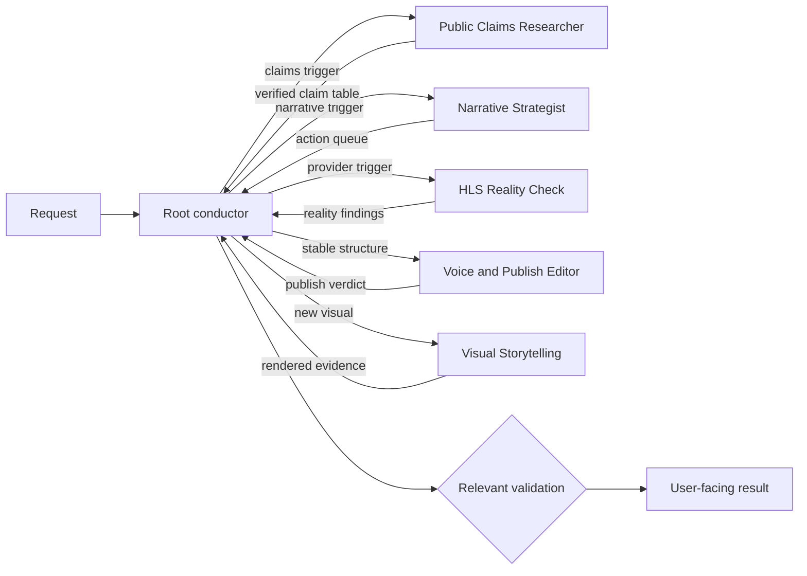

# Graph Engineering Research Note

Research date: 2026-07-29

## Finding

"Graph engineering" is an emerging practitioner label for engineering graph-structured AI-agent systems. It is not yet a settled academic field, industry standard, or single technique. Its useful contribution is to make the relationships among agents explicit and testable: roles, handoffs, state, evidence gates, topology, cost, and failure behavior.

The name also collides with older graph disciplines. In this repository, use the qualified phrase **agent workflow graph engineering** when ambiguity matters.

| Meaning | Graph represents | Relevance here |
|---|---|---|
| Agent workflow graph engineering | Agent roles, runtime tasks, handoffs, state, and gates | Immediate fit |
| Knowledge graph engineering | Entities, facts, relationships, ontology, and provenance | Possible future content feature |
| GraphRAG | A graph index used to retrieve and summarize a document corpus | Defer until ordinary search fails on a measured need |
| Graph neural networks | Learned representations and message passing over graph data | No current fit |
| Graphs of thought | Branching and merging reasoning paths inside an inference process | Useful research pattern, not a repository requirement |

## Working Model

The practical model has two views:

1. **Standing role graph:** the reusable roles, authority boundaries, tools, and allowed relationships.
2. **Run graph:** the nodes, dependencies, handoffs, and evidence realized for one request.

An edge should state:

- the source and destination;
- the condition that activates it;
- the artifact or bounded context that crosses it;
- who owns the next decision;
- the evidence required to accept the result; and
- what happens on rejection or failure.

A diagram alone is not graph engineering. The graph must constrain execution or make a run inspectable enough to evaluate and change.

## Evidence

| Source | Date | What it supports | Qualification |
|---|---|---|---|
| [Graph Engineering: A Working Definition](https://github.com/ChaoYue0307/awesome-graph-engineering/blob/main/DEFINITION.md) | July 2026 | Defines roles, typed edges, state, gates, traces, and separate standing/run graphs | Community synthesis. It explicitly calls the term emerging and non-standard. |
| [Building effective agents](https://www.anthropic.com/research/building-effective-agents) | December 2024 | Documents routing, parallelization, orchestrator-worker, and evaluator-optimizer patterns; recommends adding complexity only when outcomes improve | First-party practitioner guidance, not a controlled comparison of every architecture |
| [Effective context engineering for AI agents](https://www.anthropic.com/engineering/effective-context-engineering-for-ai-agents) | September 2025 | Treats context as finite and describes isolated subagent research with condensed handoffs | First-party practitioner guidance |
| [Towards a Science of Scaling Agent Systems](https://arxiv.org/abs/2512.08296) | Revised April 2026 | Across 260 controlled configurations, architecture effects ranged from a 80.8% gain on decomposable financial reasoning to a 70.0% loss on sequential planning | Research preprint. The result argues for task-topology fit, not multi-agent systems by default. |
| [From Local to Global: A Graph RAG Approach to Query-Focused Summarization](https://arxiv.org/abs/2404.16130) | Revised February 2025 | GraphRAG improved comprehensiveness and diversity over conventional vector RAG for global sensemaking on roughly million-token corpora | This is knowledge retrieval, not agent coordination. The evaluated workload is much larger than this blog corpus. |
| [Microsoft GraphRAG](https://github.com/microsoft/graphrag) | Accessed July 2026 | The maintained implementation warns that indexing can be expensive and recommends data-specific prompt tuning | Demonstration methodology, not an officially supported Microsoft offering |

## Repository Fit

This repository already had most of the useful structure:

- `.github/agents/` defines six bounded specialist roles.
- `.github/copilot-instructions.md` makes the root agent the conductor and decision owner.
- `.github/prompts/article-pass.prompt.md` conditionally routes research, narrative, voice, provider, visual, and rendered-review work.
- Build, browser, screenshot, source, and human checks act as evidence gates.
- `.github/insights/` gives each specialist a small persistent learning surface instead of one shared context dump.

The weak spot was visibility. The standing roles were explicit, while a request-specific execution graph and its edge contracts remained implicit.

## Pilot Added

The repository now applies a small graph discipline without adding a framework or database:

- The root conductor declares the smallest load-bearing run graph.
- A single-node run remains valid when no delegation earns its coordination cost.
- Delegations are typed edges with an input artifact, objective, constraints, output, acceptance evidence, and next decision owner.
- Independent research and review may fan out; writes stay single-owner unless branches are isolated.
- `/article-pass` declares planned handoffs after its evidence map and records the realized path, skipped nodes, and deviations.
- Added nodes and edges must improve quality, speed, cost, or risk relative to a smaller workflow.

This is intentionally prompt-native. LangGraph, Microsoft Agent Framework, or another durable runtime would add little while these workflows execute interactively inside VS Code and produce repository artifacts.

## Evaluation Plan

Evaluate the pilot over at least five representative substantive requests. Capture only signals available without adding reporting overhead:

| Signal | Question |
|---|---|
| Agent calls | Did the run use fewer or more roles than the old default? |
| Handoff rework | Did the conductor have to rediscover context or resend a task? |
| First-pass validation | Did the first relevant executable check pass? |
| Decision clarity | Was it clear why each specialist ran or was skipped? |
| Cost and time | Did extra coordination produce a visible benefit? |

Keep the run-graph section if it improves routing or explains failures. Shorten or remove fields that become ceremonial. Do not add more agents merely to make the graph richer.

## Deferred Options

1. **Build-time content graph:** generate relationships among posts, topics, citations, and Astro visual components for related-content navigation or editorial gap analysis. Start only with a concrete reader or authoring question that frontmatter and text search cannot answer.
2. **Run ledger:** persist node, edge, artifact, gate, timing, and disposition data if chat summaries prove insufficient for comparing workflows. Keep it bounded and avoid a permanent log with no review owner.
3. **GraphRAG:** pilot only when the corpus is large enough to produce recurring global or multi-hop questions that ordinary search cannot answer. Measure answer quality and indexing cost against the current approach.
4. **Durable graph runtime:** consider one only if workflows need unattended execution, checkpoint/resume, retries, concurrency control, or cross-service observability.

## Decision

Use agent workflow graph engineering now as a lightweight orchestration and evaluation discipline. Defer graph databases, GraphRAG, learned topology, and a new runtime until a measured repository need justifies their cost.